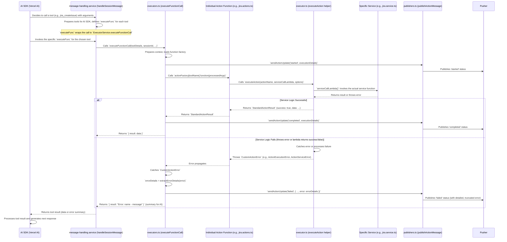

# Action Execution Flow

This document outlines the typical flow of an action execution within the system, from the AI agent's decision to call a tool, to the processing of its result or error.

## Detailed Steps

1.  **AI SDK Tool Invocation:**
    *   The AI SDK (e.g., Vercel AI SDK) determines a tool/function needs to be called based on the conversation.
    *   It invokes a corresponding JavaScript function provided to it during setup.

2.  **Message Handling Service (`src/services/assistant/message-handling.service.ts`):**
    *   The `handleSessionMessage` function is the entry point.
    *   It prepares the available tools for the AI SDK. For each action defined in the `FunctionFactory`:
        *   It creates a wrapper function (referred to as `executeFunc` in the diagram).
        *   This `executeFunc` is what the AI SDK calls. Its main responsibility is to invoke `executeFunctionCall` from `src/integrations/actions/executors.ts` with the necessary details (function name, arguments, session context).

3.  **Executor Service (`src/integrations/actions/executors.ts`):**
    *   The `executeFunctionCall` function orchestrates the actual execution:
        *   **Preparation:** It resolves the actual action ID, retrieves action metadata (description, icon, etc.), and processes input arguments (e.g., template processing).
        *   **Context Creation:** It builds the `ActionContext` (sessionId, companyId, language).
        *   **Function Factory:** It loads the `FunctionFactory` using `createFunctionFactory` to get access to all action definitions relevant to the current context and allowed actions.
        *   **Publish 'started':** It calls `sendActionUpdate` (which uses `publishActionMessage` from `publishers.ts`) to notify via Pusher that the action has started. `ExecutionDetails` are populated here.
        *   **Action Invocation:** It calls the specific action function: `functionFactory[functionName].function(processedArgs)`.
            *   **Important Note on Return Type Handling:**
                *   Historically, `executeFunctionCall` expected the action function to return an `ActionResult` object (`{ success: boolean; data?: any; error?: string; }`).
                *   The current standard (June 2025) is that action functions return `Promise<StandardActionResult<R>>` (which always implies `success: true`) and **throw custom errors** for failures.
                *   `executeFunctionCall` has a `try...catch` block. If the action function throws an error (as per the current standard), this `catch` block handles it. If the action function (older style) returns `{ success: false, error: "..." }`, `executeFunctionCall` also handles this path.

4.  **Individual Action Function (e.g., `src/integrations/jira/jira.actions.ts`):**
    *   This is the specific function defined for an action (e.g., `createIssue`, `getSprints`).
    *   **Standard Implementation:** It should use the `executeAction` helper from `src/integrations/actions/executor.ts`.
        *   It performs initial input validation (throwing `ActionValidationError` if needed) *before* calling `executeAction`.
        *   It calls `executeAction(actionName, serviceCallLambda, options)`.

5.  **Core Executor Helper (`src/integrations/actions/executor.ts`):**
    *   The `executeAction` helper function:
        *   Takes the action name, a `serviceCallLambda`, and options.
        *   The `serviceCallLambda` is an async function that:
            *   Calls the underlying business logic/service function (e.g., in `your_integration.service.ts`).
            *   Adapts the service's response to `Promise<{ success: boolean; data?: YourActionData; error?: string; description?: string; }>`.
            *   Alternatively, the service function itself (or the lambda) can throw an error.
        *   `executeAction` then:
            *   If `serviceCallLambda` resolves with `success: true`, it returns a `StandardActionResult<YourActionData>`.
            *   If `serviceCallLambda` resolves with `success: false`, it throws an `ActionServiceError` using the `description` or `error` from the lambda's response.
            *   If `serviceCallLambda` (or the underlying service) throws any other error, `executeAction` catches it and wraps it in an `ActionExecutionError`.
        *   Essentially, `executeAction` ensures that a successful operation results in `StandardActionResult`, and any failure results in a thrown custom error.

6.  **Specific Service Logic (e.g., `src/integrations/jira/jira.service.ts`):**
    *   Contains the actual business logic for the integration (e.g., making API calls to Jira).
    *   This layer can throw its own errors or return specific structures that the `serviceCallLambda` (in step 5) adapts.

7.  **Result/Error Propagation back to `executeFunctionCall`:**
    *   **Success:** If `executeAction` returns `StandardActionResult`, this is passed back to `executeFunctionCall`. `executeFunctionCall` then calls `sendActionUpdate` with 'completed' status and the result data. It returns `{ result: data }` to `message-handling.service`.
    *   **Failure (Error Thrown by `executeAction`):** The custom error thrown by `executeAction` (e.g., `ActionExecutionError`, `ActionServiceError`) is caught by the `try...catch` block within `executeFunctionCall`.
        *   `executeFunctionCall` uses `extractErrorDetails` (from `src/integrations/actions/utils.ts`) to convert the caught custom error into a structured `DetailedError` object.
        *   It then calls `sendActionUpdate` with 'failed' status, including the `DetailedError` object in `executionDetails.error`.
        *   It returns a simplified error summary `{ result: "Error: <error.name> - <error.message>" }` to `message-handling.service`. This summary is for the AI SDK's immediate use, while the detailed error is sent via Pusher.

8.  **Publisher (`src/integrations/actions/publishers.ts`):**
    *   The `publishActionMessage` function (called by `sendActionUpdate`):
        *   Saves the action's progress (started, completed, failed) to the database (`Message` model).
        *   For 'failed' status, the `messageData.error` field will contain the `DetailedError` object.
        *   **Crucially, it now truncates both `messageData.output` and `messageData.error` using `truncateForPusher` before sending the message via Pusher.** This ensures large error objects don't get cut off by Pusher's limits, allowing the client/AI agent to receive as much detail as possible.
        *   Publishes the message to the appropriate Pusher channel.

9.  **Back to AI SDK:**
    *   `message-handling.service` returns the simplified result or error summary to the AI SDK.
    *   The AI SDK uses this information, along with any detailed error messages received asynchronously via Pusher, to decide on the next step in the conversation.

This flow ensures that actions are executed consistently, errors are handled robustly, and detailed status updates (including comprehensive error information) are communicated effectively.
